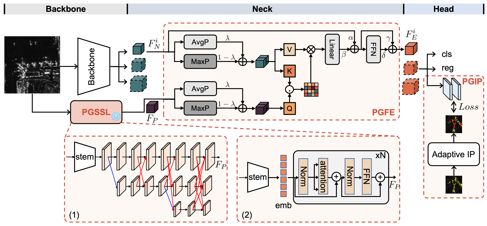

Physics-Guided Detector (PGD) for SAR Airplane
==== 
1.Introduction  
------- 
Please refer to this work: [Physics-Guided Detector for SAR Airplanes, IEEE TCSVT 2025](https://ieeexplore.ieee.org/abstract/document/11079686)

### 1.1 Features


The detailed implementation of the proposed physics-guided detector for SAR airplanes.


The explanation results based on Grad-CAM for PGD and PGD-Lite models.


### 1.2 Contribution
* A general physics-guided detector (PGD) learning paradigm is proposed for SAR airplane detection and fine-grained classification, aiming to address the challenges of discreteness and variability.
* PGD is consist of physics-guided self-supervised learning (PGSSL), feature enhancement (PGFE) and instance perception (PGIP).
* Extensive experiments are conducted on SAR-AIRcraft-1.0 dataset. Based on existing detectors, we construct nine PGD models for evaluation.

2.Previously on PGD
------- 
In our precious works, we propose a physics guided learning method for SAR airplane target feature representation, where the airplane scattering characteristics are extracted to guide the model training.

```
@inproceedings{wang2023new,
  title={A new Perspective on Physics Guided Learning for SAR Image Interpretation},
  author={Wang, Zishi and Huang, Zhongling and Datcu, Mihai},
  booktitle={IGARSS 2023-2023 IEEE International Geoscience and Remote Sensing Symposium},
  pages={1926--1929},
  year={2023},
  organization={IEEE}
}
```

3.Getting Started
------- 
### 3.1 Requirements
Code is based on an  object detection YOLOv5. Please refer to [requirements.txt](https://github.com/ultralytics/yolov5/blob/master/requirements.txt) for installation and dataset preparation.

### 3.2 Preparation process
The code are proposed here. We will complete the pivotal code after the paper is accepted.

The file directory tree is as below:
```
├── data
│   ├── SAR_AIRcraft
│   │   ├── test
|   |   |   |——images
|   |   |   |——labels
│   │   ├── train
|   |   |   |——images
|   |   |   |——labels
│   │   ├── val
|   |   |   |——images
|   |   |   |——labels
├──models
│   ├── common.py
│   ├── PGD_yolo.py
│   ├── ...
├──tools
│   ├── main_cnn.py
│   ├── utils.py
│   ├── ...
```

### 3.3 Data Preparation
SAR-AIRcraft-1.0:[https://radars.ac.cn/cn/article/doi/10.12000/JR23043](https://radars.ac.cn/cn/article/doi/10.12000/JR23043)

### 3.4 Train for PGD
```python
python train_PGD.py --data data/SAR_PLANE.yaml  --cfg models/hub/resnet18_RepPAN.yaml  --hyp data/hyps/hyp_SARPLANE.yaml 
```

### 3.5 Train for PGD_Lite
```python
python train_PGD_Lite.py --data data/SAR_PLANE.yaml  --cfg models/hub/resnet18_RepPAN.yaml  --hyp data/hyps/hyp_SARPLANE.yaml 
```

### 3.6 Pre-training weights
PGD:download(https://pan.baidu.com/s/13OMggVOiwatqLR4hWIMMvA?pwd=zjs9)
PGD_Lite:download(https://pan.baidu.com/s/1Hmt5lFrfHbJRfddJWL2dUg?pwd=ithq)

4.Citation
------- 
If you find this repository useful for your publications, please consider citing our paper.

```
@article{huang2025physics,
  title={Physics-Guided Detector for SAR Airplanes},
  author={Huang, Zhongling and Liu, Long and Yang, Shuxin and Wang, Zhirui and Cheng, Gong and Han, Junwei},
  journal={IEEE Transactions on Circuits and Systems for Video Technology},
  year={2025},
  publisher={IEEE}
}
```
